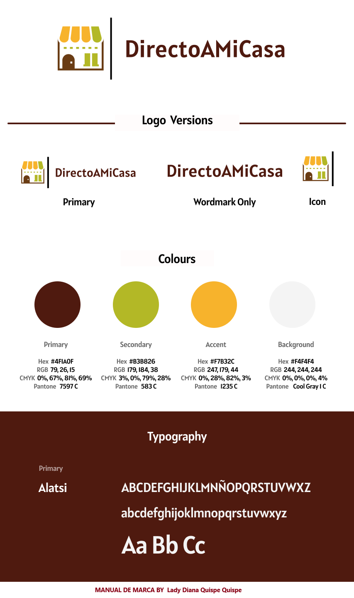

<p align="center">

</p>

<p align="center">
  <h1 align="center">DirectoAMiCasa - Mini Market</h1>
</p>

## Índice

* [1. Introducción](#1-introducción)
* [2. Estructura del proyecto](#2-estructura-del-proyecto)
* [3. Funciones y componentes](#3-funciones-y-componentes)
* [4. Consumo de APIs](#4-consumo-de-apis)
* [5. Beneficios de la refactorización](#5-beneficios-de-la-refactorización)
* [6. Guía para ejecutar el proyecto](#6-guía-para-ejecutar-el-proyecto)

## 1. Introducción

DirectoAMiCasa es una plataforma de e-commerce enfocada en brindar a los usuarios la mejor experiencia al realizar compras desde la comodidad de su hogar. Utilizamos Vanilla JavaScript, HTML5, y CSS3, incorporando buenas prácticas de modularidad y reutilización de código.

Este proyecto es parte del Bootcamp Frontend React NTT, donde se exploran conceptos básicos y avanzados de desarrollo web con integración de APIs.

## 2. Estructura del proyecto

La siguiente es la estructura del proyecto DirectoAMiCasa. Cada carpeta y archivo tiene una función específica que contribuye al desarrollo modular y escalable de la aplicación. Esta estructura garantiza que el proyecto sea fácil de navegar y mantener.

### Estructura de Carpetas

```javascript
```plaintext
src/
├── assets/                    # Contiene recursos estáticos como imágenes, fuentes, etc.
├── components/                # Componentes reutilizables de la interfaz
│   ├── cartHandler.js         # Manejo del carrito de compras
│   ├── renderCategories.js    # Lógica para renderizar las categorías
│   └── renderProducts.js      # Lógica para renderizar productos
├── css/                       # Archivos de estilos CSS
│   └── styles.css             # Archivo principal de estilos
├── js/                        # Lógica principal del proyecto
│   ├── api/                   # Funciones relacionadas con la interacción con la API
│   │   ├── fetchCategories.js # Lógica para obtener categorías
│   │   └── fetchProducts.js   # Lógica para obtener productos
│   ├── mappers/               # Transformación de datos (mappeo)
│   │   ├── categoryMapper.js  # Mapeo de datos para las categorías
│   │   └── productMapper.js   # Mapeo de datos para los productos
│   └── main.js                # Archivo principal del proyecto
├── utils/                     # Utilidades y funciones auxiliares
│   ├── helpers.js             # Funciones de ayuda generales
│   └── uiHelpers.js           # Funciones para la manipulación del estado de la UI
├── .gitignore                 # Archivos y carpetas ignorados por Git
├── index.html                 # Archivo HTML principal
├── package-lock.json          # Archivo generado automáticamente para las dependencias
├── package.json               # Archivo de configuración del proyecto y dependencias
└── README.md                  # Documentación del proyecto  ```
```

## 3. Funciones y componentes

### Renderización de Productos

Ubicado en `components/renderProducts.js`, esta función permite renderizar dinámicamente productos desde el servicio `dummyjson`.

**Beneficio:** Modularidad y reutilización.

#### Lógica Principal:

- Elimina productos anteriores del contenedor.
- Genera dinámicamente cada producto en formato `card`.
- Incluye un botón para agregar al carrito.

---

### Manejo de Categorías

El archivo `components/categoryDropdown.js` se encarga de cargar y filtrar categorías dinámicamente.

#### Función Principal:

Permitir que los usuarios filtren productos por categorías.

#### APIs utilizadas:

1. **Productos**
2. **Categorías**

---

### Botón de Cerrar y Restablecer Vista

La función `resetUIState` (ubicada en `utils/helpers.js`) permite regresar al estado inicial del marketplace cuando el usuario hace clic en el logo o en el botón de cerrar.

#### Uso Reutilizable:

```javascript
resetUIState(); // Para resetear la vista actual. 


```

---

## 4. Consumo de APIs

El proyecto utiliza dos servicios REST principales:

### Obtener Productos

- **URL:** [https://dummyjson.com/products](https://dummyjson.com/products)
- **Método:** `GET`
- **Función:** Obtiene la lista completa de productos.

---

### Obtener Categorías

- **URL:** [https://dummyjson.com/products/categories](https://dummyjson.com/products/categories)
- **Método:** `GET`
- **Función:** Carga el desplegable de categorías para filtrar productos.

---

### Manejador de Peticiones

El archivo `js/fetchProducts.js` contiene la lógica principal para realizar las peticiones a las APIs. Utiliza `fetch` con `async/await` para garantizar solicitudes seguras y manejar errores eficientemente.

## 5. Beneficios de la refactorización

- **Modularidad:** Cada funcionalidad está en su propio archivo, lo que mejora la legibilidad y el mantenimiento del código.
- **Reutilización:** Componentes como `renderProducts` y `resetUIState` pueden ser utilizados en diferentes partes del proyecto.
- **Mantenibilidad:** Separar lógica y renderizado facilita el debug y la incorporación de nuevas funcionalidades.

---

## 6. Guía para ejecutar el proyecto

### Requisitos Previos

- Tener instalado `Node.js`.

### Clonar el repositorio:

```bash
git clone https://github.com/LadyDi3103/BOOTCAMP-FRONTEND-REACT-NTT.git
npm install
npm run dev
http://localhost:5173

```

---

## Manual de Marca

Durante el desarrollo de este proyecto, trabajé en la creación del **Manual de Marca** para garantizar la consistencia visual y de estilo de DirectoAMiCasa. Este documento establece los lineamientos gráficos, colores y tipografías que representan la identidad visual de la aplicación.

### Imagen del Manual de Marca

<p align="center">
  
</p>

### Elementos del Manual de Marca

- **Logos:**

   - Versión Principal
   - Solo el Wordmark
   - Solo el Icono

- **Paleta de Colores:**

   - **Primary (Marrón):** Hex `#4F1A0F`, RGB `79, 26, 15`
   - **Secondary (Verde):** Hex `#B3B826`, RGB `179, 184, 38`
   - **Accent (Amarillo):** Hex `#F7B32C`, RGB `247, 179, 44`
   - **Background (Gris Claro):** Hex `#F4F4F4`, RGB `244, 244, 244`

- **Tipografía Principal:**

   - **Fuente:** Alatsi
   - **Usos:** Títulos y contenido general

El **Manual de Marca** refuerza el diseño y la experiencia del usuario, asegurando que todos los elementos visuales mantengan una coherencia en la presentación de la marca.
